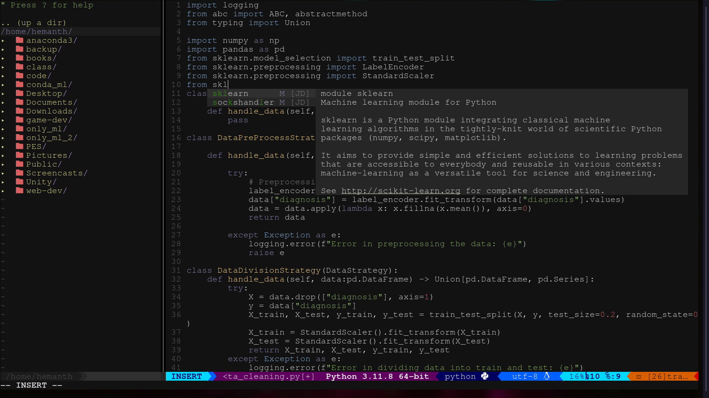

## Configuration of my NVIM editor
#### Also configured for auto-complete code

**NOTE**: using vim plugin manager



Create a file named `~/.config/nvim/init.vim`
<br/>

Then run the below command to install vim-plugin manager

```bash
curl -fLo ~/.var/app/io.neovim.nvim/data/nvim/site/autoload/plug.vim --create-dirs \ 
	https://raw.githubusercontent.com/junegunn/vim-plug/master/plug.vim
```

Now open the file init.vim using `nvim`
<br/>
And in the command mode
```bash
:PluginInstall
```

Install required dependencies:

```bash
sudo apt-get install exuberant-ctags
sudo apt-get install npm
sudo apt-get install nodejs
sudo apt-get install python3-pip
pip install jedi
```

Now find the `coc.vim` folder, which usually in `~/.config/nvim/plugged/coc.nvim` or `~/.local/share/nvim/plugged/coc.nvim`

<br/>
Go to that directory
then

```bash
sudo npm install -g yarn
yarn install
yarn build
```

<br/>
to enable autocomplete for python, web-dev
in the nvim's command mode

```bash
:CocInstall coc-python
:CocInstall coc-json coc-tsserver coc-prettier coc-html coc-css
```
now autocomplete for python got enabled
<br/>
To delete any Plugins, remove the Plugin from init.vim file and
```bash
:PlugClean
```
